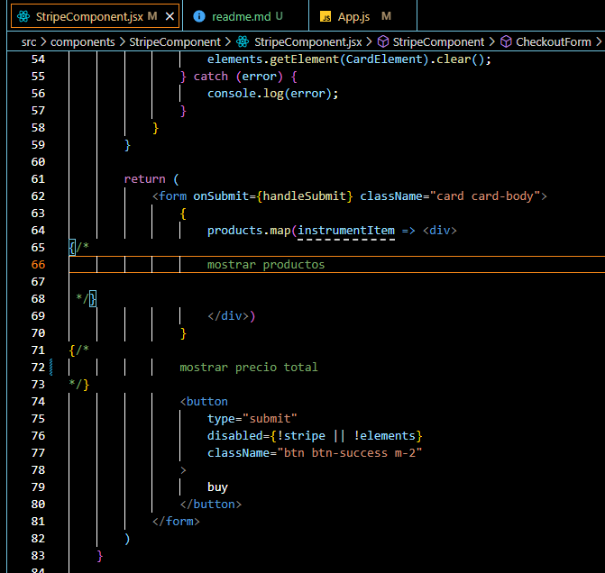

mostrar vistas de componentes en la ubicacion indicada.

<p align="left">
  
</p>


y debajo el total de la suma de los costos de los productos.


Poner un boton en la homepage que dirija a este componente cuando el usuario ya termine de elegir los productos.


```así debe ser el req.body```

```
{
  id: paymentMethod.id,
  user = "_id"
  products = [
               {
                  products: "_id",
                  quantity: 1
                },{
                  products: "_id",
                  quantity: 1
                }
              ]
}
```
